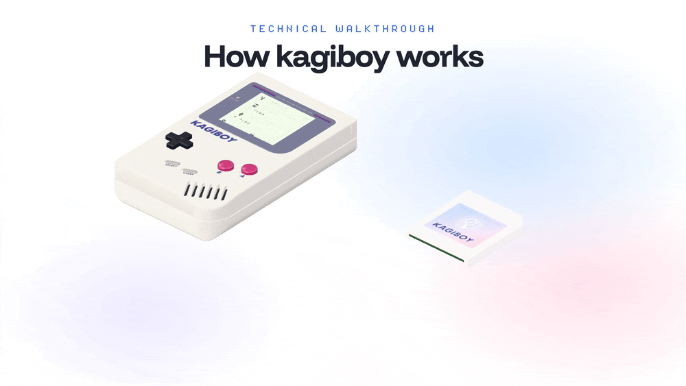
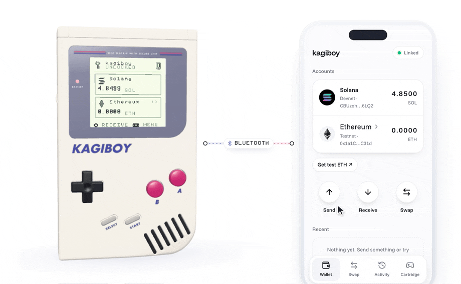
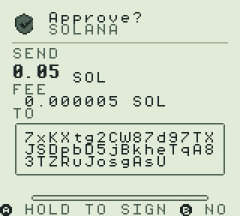
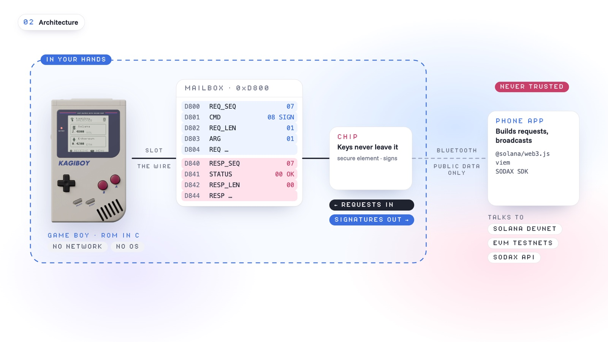
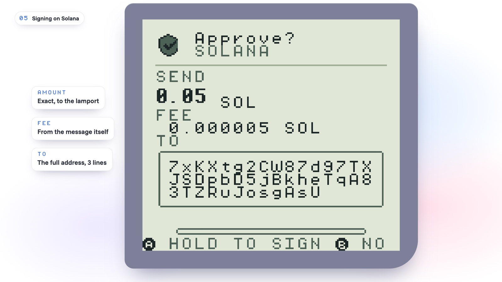
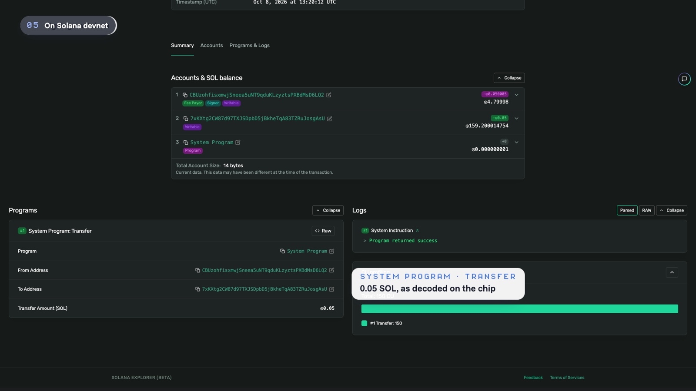
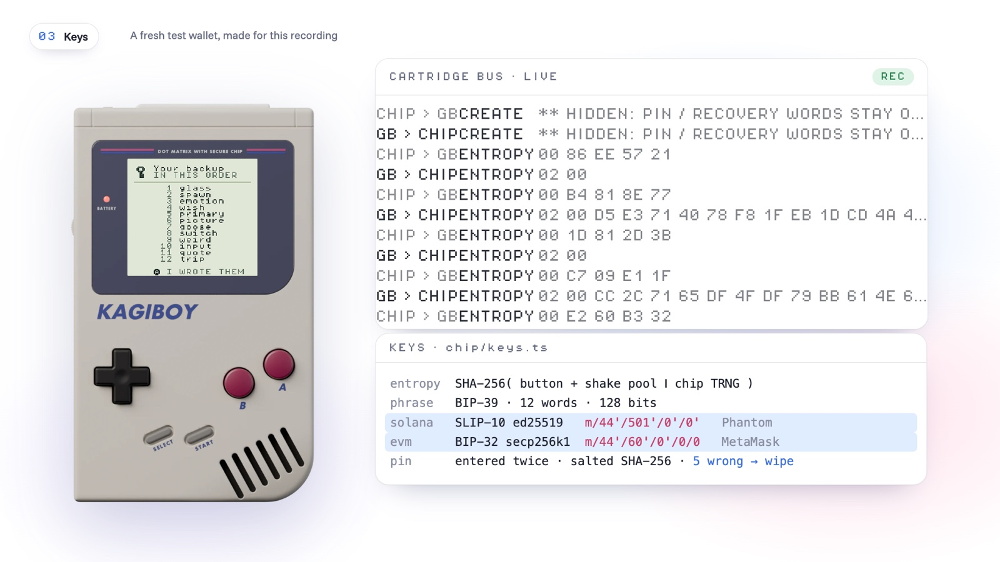
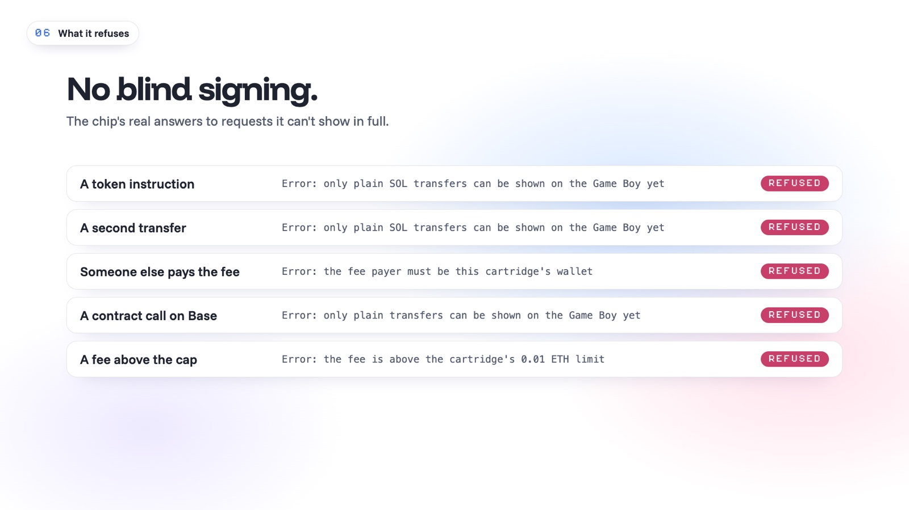
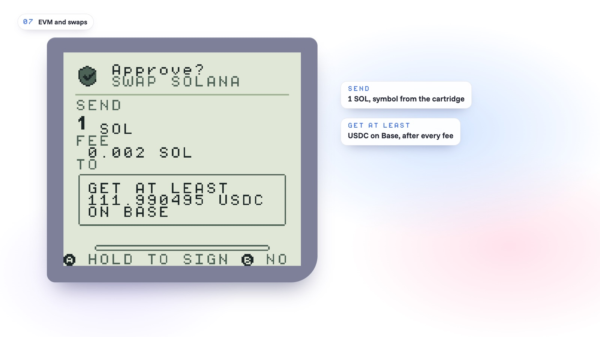
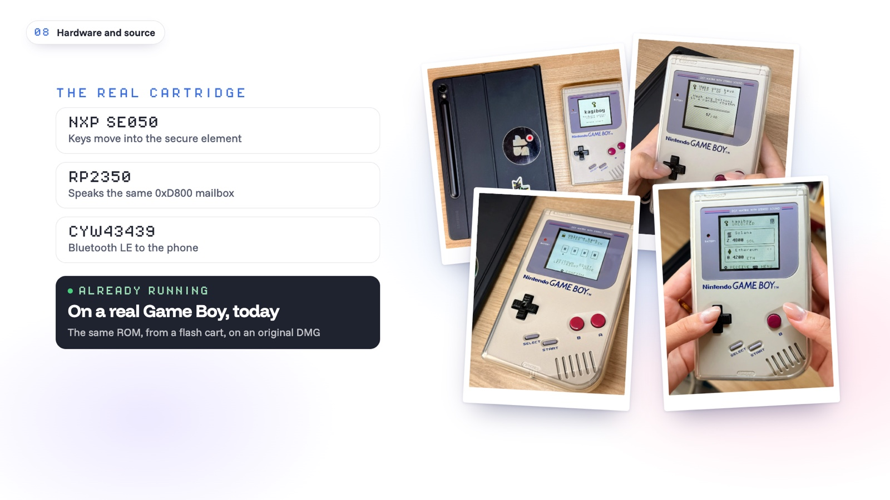

<p align="center">
  <picture>
    <source media="(prefers-color-scheme: dark)" srcset="docs/media/logo-white.png">
    
  </picture>
</p>

<p align="center">
  A hardware wallet that lives in a Game Boy cartridge.<br>
  <a href="https://kagiboy.xyz/demo"><b>Try the live demo</b></a> &nbsp;·&nbsp;
  <a href="https://kagiboy.xyz">Website</a> &nbsp;·&nbsp;
  <a href="https://kagiboy.xyz/about">The story</a> &nbsp;·&nbsp;
  <a href="docs/protocol.md">Protocol</a>
</p>

<p align="center">
  
</p>

My dad found my first Game Boy at a flea market. These days the things I care most about are numbers on a phone, and the phone that asks me to approve a transaction is the same phone that tells me what I'm approving. If it lies, I sign the lie.

A Game Boy can't lie to you like that. It has no network, no apps and no operating system. It's a screen and some buttons. So kagiboy puts the keys in a cartridge and uses the Game Boy as the one screen you trust: the cartridge reads every request itself, puts the amount and the full address on that little LCD, and signs only after you hold A. The phone just builds transactions and broadcasts them. It never sees a key.

This repo has all of it: the Game Boy ROM, the cartridge's chip (simulated for now), the phone app, the website, the 3D model and the videos.

> **Status, honestly.** The software is real and runs on testnets today: Solana devnet and five EVM testnets. The ROM runs on a real Game Boy from a flash cart and in your browser. The cartridge itself is in production; until it ships, its key chip is simulated in the browser. The parts and the plan are in [docs/hardware.md](docs/hardware.md). Please don't put a real recovery phrase anywhere near this.

## See it work

<table>
  <tr>
    <td width="62%"></td>
    <td width="38%"></td>
  </tr>
  <tr>
    <td>The phone asks for 0.05 SOL. The Game Boy shows what the chip decoded.</td>
    <td>Hold A for a second. Signed, then confirmed on devnet.</td>
  </tr>
</table>

That transfer is a real devnet transaction: [GeVGY7kn…wEM7BDtK on the Solana explorer](https://explorer.solana.com/tx/GeVGY7kn36SS1aoRXbDQo8WiwukHD4XpPiuzs3X6jpgkfGJWR1dPgesg2B4Dwk2wuS7ngjqYkWEWH11wEM7BDtK?cluster=devnet). Same signature the Game Boy printed.

## Try it

Open **[kagiboy.xyz/demo](https://kagiboy.xyz/demo)**, on a laptop or a phone. It takes about two minutes.

1. Switch on, press Start, pick **New wallet**.
2. Mash buttons, then hold **shake**. Write down the 12 words (they're test words, but play along) and pick a PIN.
3. In the phone app, tap **Pair cartridge**. The same six digits show up on both screens. Press A.
4. Get some devnet SOL with **Get test SOL**, then **Send**. Read what the Game Boy says, hold A.

Keys on a laptop: arrows, `X` = A, `Z` = B, `Enter` = Start, `Shift` = Select. On a phone, tap the console. The bus monitor under the Game Boy shows every message between the console and the chip, with the PIN and the words blanked out.

## How it works



There are three parts, and only the cartridge ever holds a key.

The Game Boy ROM (`rom/`, C with GBDK-2020) is the screen and the buttons. It never touches a key. A Game Boy has exactly one wire to the outside world, the cartridge slot, so that's what we use: the ROM writes a command into a 256-byte mailbox in cartridge memory, and the chip writes its answer back into the same window. Each side owns its own bytes, and the sequence number is written last, so a half-written reply is never read. The commands are in [docs/protocol.md](docs/protocol.md).

The cartridge chip (`web/src/chip/`) holds the keys, counts PIN tries, keeps a network allowlist and its own token list, and decodes and signs. In the demo it's TypeScript running in your browser. On the real cartridge it's an RP2350 with the keys in an NXP SE050 secure element.

The phone app (`web/src/phone/`, `web/src/app/`) talks to the networks: balances, building transactions, broadcasting them. It reaches the chip over Bluetooth on hardware (a function call in the demo) and only ever gets public data back. It's never trusted.

### Signing on Solana



This is the part I care about most. The phone builds a normal `SystemProgram.transfer` and hands over the serialized message bytes, nothing else. The chip copies those bytes, so nothing can change them later, and decodes them itself: the fee payer has to be this cartridge, there has to be exactly one instruction, it has to be a plain transfer from this wallet, and the amount and full address have to fit on the Game Boy screen. If any of that fails, there's no prompt at all. You hold A, the chip signs those exact bytes with ed25519, and the phone broadcasts.

The phone can't fake the result either. It reports a status, but the Game Boy only shows "confirmed" next to the signature the chip itself produced (`setTxStatus` in [chip.ts](web/src/chip/chip.ts)).



### Keys



Every button press and every shake goes to the chip as entropy and gets folded into a SHA-256 pool, which is mixed with the chip's own random generator when the wallet is created. Out come 12 standard BIP-39 words. Solana keys use SLIP-10 ed25519 on Phantom's path (`m/44'/501'/0'/0'`), EVM keys use MetaMask's (`m/44'/60'/0'/0/0`), so the words restore in any normal wallet. The PIN is entered twice and stored salted and hashed. Five wrong tries and the cartridge wipes itself, like a Ledger.

### What it refuses



If the chip can't show something in full, it won't sign it. Those are the chip's real error messages, captured by sending it those requests.

### EVM and swaps



The same 12 words cover Ethereum Sepolia, Base Sepolia, Arbitrum Sepolia, HyperEVM testnet and Robinhood Chain testnet, and LEFT/RIGHT on the Game Boy switches between them. The chip checks the chain id against its allowlist and refuses any fee above 0.01 of the network's coin.

Swaps come from the [SODAX](https://sodax.com) SDK with live quotes. The phone only names tokens by address; symbols, decimals and fees come from the cartridge's own list ([tokens.ts](web/src/chip/tokens.ts)), and the Game Boy shows the least you'll get, after every fee. In the demo, swaps are signed but never sent.

## It runs on a real Game Boy



These are photos of my own DMG running the ROM from an EverDrive. A flash cart has no key chip, so `make demo` builds the prototype with a test chip inside the ROM, generated from the real chip code. It saves the wallet and PIN to the cartridge's battery RAM and plays a little chiptune of mine on the menus. It holds no real keys; it's there so the whole flow can be walked through on a real Game Boy while the cartridge is in production.

## Build it

The ROM needs [GBDK-2020](https://github.com/gbdk-2020/gbdk-2020). The Makefile looks in `~/gbdk`; override it with `make GBDK=/path/to/gbdk`.

```sh
cd rom
make          # build/wallet.gb, also copied to web/public/wallet.gb
make demo     # build/wallet-demo.gb, the flash-cart prototype build
```

The website and demo are Vite + React + TypeScript.

```sh
cd web
pnpm i
pnpm dev               # then open /demo
pnpm build
pnpm smoke smoke-out   # the real ROM against the chip, headless
```

The smoke test is the thing I trust most in this repo. It boots the real ROM in the emulator and drives it like a person would: setup, reading the Game Boy's QR codes back, signing a SOL transfer and an ETH transfer and checking both signatures, rejecting one, making sure the phone can't put its own words on the screen, signing on HyperEVM, pulling the power mid-request, wiping after five wrong PINs, and restoring a BIP-39 test vector letter by letter. It saves a PNG of every screen and fails loudly.

Everything runs without API keys. The only one is the waitlist on the website, which needs Upstash credentials (`vercel env pull`).

## What's where

| Path | What |
|---|---|
| [`rom/`](rom) | The Game Boy ROM, in C. Setup, entropy, words, PIN, restore with word suggestions, QR codes, hold-to-sign, network switching, pairing. |
| [`web/`](web) | The website and the demo. The chip lives in `src/chip/`, the phone side in `src/phone/` and `src/app/`. |
| [`native/`](native) | A Capacitor shell that packages the demo as an iOS and Android app. No native Bluetooth yet. |
| [`assets/`](assets) | The Blender model and scripts, product renders, the logo and the social card. |
| [`video/`](video) | Both submission videos, built in Remotion, plus the scripts that recorded the demo footage. |
| [`docs/`](docs) | Protocol, hardware, roadmap, four rounds of audits, the pitch material. |

## Security model, and what isn't solved yet

kagiboy is built to hold up against three things: someone who steals the cartridge, a compromised phone asking for something you didn't mean, and someone listening to the Bluetooth link. What you approve is what the chip decoded and drew on the Game Boy, and only the A button on the Game Boy approves it.

What isn't solved, in the demo:

- The browser demo keeps the recovery phrase in `localStorage`, in plain text. It uses the same derivation paths as Phantom and MetaMask, so a real phrase typed in here maps to your real accounts. Test words only. The ROM says so before a restore.
- A Solana transaction doesn't say which cluster it's for, so the chip can't prove a malicious phone didn't use a mainnet blockhash. EVM is different: there the chip enforces the chain id.
- There's no auto-lock. The chip stays unlocked while it has power.
- Approving signs whatever request is pending. That's safe today because the phone can't replace or cancel a pending request, but it should be bound to a digest of what was shown before any queueing is added.
- On OP-stack chains like Base, the L1 data fee is charged outside gas times max fee, so "MAX" isn't a strict cap there. It's around 2×10⁻¹⁶ ETH on Base Sepolia.
- Balances come from the phone. The chip formats them but can't verify them.
- Swaps get live quotes from SODAX, and the cartridge decodes each one against its own token list and signs it. This build doesn't submit the signed swap to SODAX yet; that's the next step.
- `pnpm audit --prod` reports 8 advisories, all deep inside the `@sodax/sdk` dependency tree. Same-major fixes are pinned; the rest need an SDK update. The SDK only loads on the swap screen.

And in the hardware design:

- Transaction decoding, the fee cap and the PIN session run on the RP2350, not inside the secure element. The SE050 stops keys being extracted, not misuse by compromised firmware. The plan is signed firmware, the Bluetooth stack in TrustZone's non-secure world, and a potted board.
- The SE050 can't derive BIP-32 or SLIP-10 keys, so the seed lives on the MCU during setup. The plan is to derive once, import the keys into the secure element and erase the seed.
- The PIN and the words cross the cartridge bus in plain text, and a modified console could fake button presses. Use your own, unmodified Game Boy.
- The cartridge is in production and nothing has had an outside security review yet. Nobody should store real money on this until the audited cartridge ships.

The four audit rounds are in [docs/audits](docs/audits). The path to a cartridge you can actually buy is in [docs/ROADMAP.md](docs/ROADMAP.md).

## Thanks, and licenses

kagiboy is [MIT licensed](LICENSE). The `/demo` page bundles the [serverboy](https://gitlab.com/piglet-plays/serverboy.js) emulator (built on Grant Galitz's GameBoy-Online), which is GPL-2.0, so that one bundle is distributed under GPL-2.0. [NOTICE](NOTICE) has the details and the other third-party licenses. The ROM is built with GBDK-2020, the pixel font is Pixel Operator (CC0), and swaps run on SODAX.

Game Boy is a trademark of Nintendo. kagiboy isn't affiliated with Nintendo, and it's a hackathon project for the Colosseum Crypto World's Fair, not a product you can buy yet.
